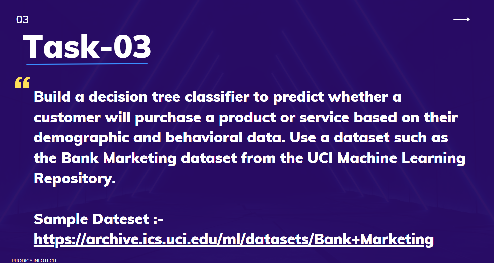

# Prodigy_Infotech_DataScience-Task3
## INTRODUCTION
This repository contains my submission for Task 3 of the Data Science Internship at Prodigy InfoTech. In this task, I applied machine learning models to predict whether clients will subscribe to a term deposit, using demographic and behavioral data collected from direct marketing campaigns conducted by a Portuguese banking institution.

## PROJECT OVERVIEW
The objective of this project is to build predictive models that can help banking institutions identify customers who are more likely to subscribe to term deposits. By detecting potential subscribers in advance, banks can improve their marketing efficiency, optimize campaign strategies, and increase customer conversion rates.

## DATASETS
The dataset used in this project is derived from direct marketing campaigns (via phone calls) of a Portuguese banking institution.
It contains:

- Client demographics (e.g., age, job, marital status)

- Previous marketing interactions

- Outcome of the campaign (whether the client subscribed to a term deposit or not)

This dataset is widely used in machine learning research for classification problems.

## RESULTS
I implemented Decision Tree Classifiers using both Gini Impurity and Entropy as splitting criteria.

- Both models achieved high accuracy in predicting client subscriptions.

- The Gini-based model slightly outperformed the Entropy-based model in terms of testing accuracy and recall for the positive (subscribed) class.

## CONCLUSION
This project highlights the power of machine learning in predictive analytics. By leveraging classification models, banking institutions can better understand customer behavior, enhance marketing strategies, and effectively target potential subscribers.

Thank you for reviewing my internship task submission!
